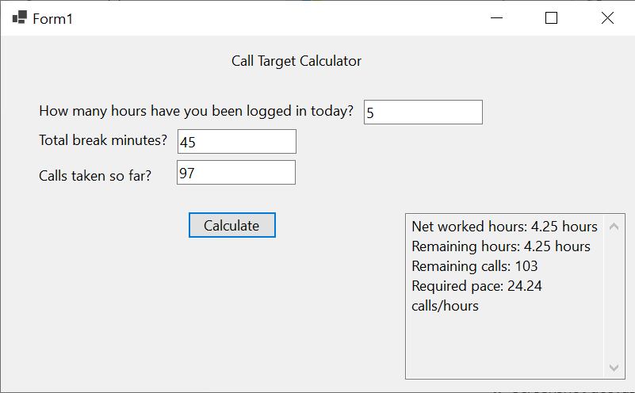

# Call Target Calculator (WinForms GUI)

A Windows Forms (C#) application that calculates the required call pace to reach a fixed daily performance target.  

This project is the GUI implementation of my original Java console version.

---

## 📌 Based On

This project is implemented based on my original Java console version:

👉 https://github.com/atakankeskin99/call-target-calculator

The core calculation logic has been adapted from Java to C# and redesigned with a graphical user interface using WinForms.

---

## 🚀 Features

- Input:
  - Login hours
  - Break minutes
  - Calls taken so far
- Calculates:
  - Net worked hours
  - Remaining working hours
  - Remaining calls
  - Required calls per hour
- Input validation with user-friendly error messages
- Read-only output panel

## 🧮 Core Calculation Logic

- Daily target: 200 calls
- Daily net working hours: 8.5 hours
- Net worked time = Login hours − (Break minutes / 60)
- Required pace = Remaining calls / Remaining hours
  
---

## 🛠 Tech Stack

- C#
- .NET
- Windows Forms (WinForms)

---

## 🎯 Purpose

This project is part of my learning journey in:

- Object-Oriented Programming
- Desktop Application Development
- Translating business logic between languages (Java → C#)
- Building GUI-based tools from console applications

<h2>🖼️ Application Screenshot</h2>

  
   
  <em>Call Target Calculator — WinForms GUI</em>

  ## 🧠 Mini Case Study — Call Target Calculator (WinForms)

### 📌 Problem

During a working day, it can be difficult to track performance pace relative to a fixed daily target.

This project provides a simple tool that calculates the required call rate based on logged-in hours, break time, and calls completed so far.

This project provides a simple tool that calculates the required call rate based on logged-in hours, break time, and calls completed so far.

---

### 🎯 Project Goals

- Translate an existing Java console application into a C# WinForms desktop application  
- Preserve core business logic while changing the presentation layer  
- Practice GUI-based user interaction and event-driven programming  
- Implement basic input validation in a desktop environment  
- Keep the structure clean and beginner-friendly  

This project is intentionally **learning-focused**, not production-grade.

---

### 🛠️ Approach & Design Decisions

- Built using:
  - C#
  - .NET
  - Windows Forms (WinForms)

- The core logic was adapted from my original Java console version:  
  👉 https://github.com/atakankeskin99/call-target-calculator

- Constants used:
  - Daily target calls: `200`
  - Daily net working hours: `8.5`

- Input validation implemented using:
  - `double.TryParse`
  - `int.TryParse`
  - `MessageBox` feedback for invalid input

- Output panel:
  - Multiline
  - Read-only
  - Structured for clarity

The main architectural goal was separating:

- UI layer (WinForms controls)
- Business logic (calculation logic inside event handler)

---

### 📚 What I Learned

- How event-driven programming works in WinForms  
- How to wire UI controls to backend logic (`Click` events)  
- Differences between console-based and GUI-based input handling  
- Translating logic between programming languages (Java → C#)  
- Debugging designer-related issues in WinForms  
- Structuring GitHub repositories for incremental improvement  

---

### ⚠️ Limitations

This application is intentionally simple.

It does not include:

- Dynamic shift lengths
- Configurable daily targets
- Persistent data storage
- Advanced validation rules
- Unit testing (yet)

The UI is functional but minimal.

---

### 🚀 Possible Improvements

- Extract business logic into a separate service class  
- Add unit tests (xUnit / NUnit)  
- Make daily targets configurable  
- Improve UI layout and spacing  
- Add dark mode styling  
- Convert to WPF or a web-based version  

---

### ✅ Why This Project Matters

Although simple, this project demonstrates:

- Business logic implementation  
- Cross-language adaptation (Java → C#)  
- Basic desktop application architecture  
- Iterative development mindset  

It represents a practical step in transitioning from console-based programming to GUI application development.

This represents another step forward in my learning journey.

